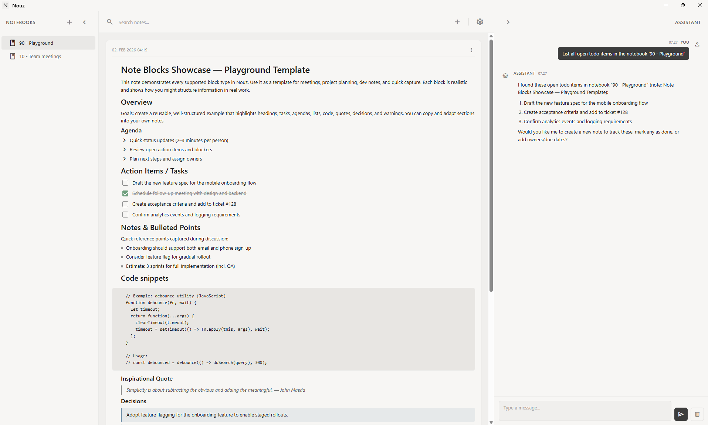

# Nouz

[](https://github.com/spflugi/nouz/actions/workflows/build-linux.yml)
[](https://github.com/spflugi/nouz/actions/workflows/build-macos.yml)
[](https://github.com/spflugi/nouz/actions/workflows/build-windows.yml)
[](https://github.com/spflugi/nouz/actions/workflows/deploy.yml)

A minimalist, fully local, AI-powered note-taking desktop app built with Tauri and React. Nouz combines block-based editing with intelligent AI assistance to help you capture, organize, and retrieve your thoughts effortlessly.

## Features

### Local, No Cloud

- All data is saved locally in a SQLite database
- Your notes and API keys never leave your machine

### Block-Based Note Editing

Build notes from flexible, reusable blocks:

- **Text blocks** — Paragraphs, headings (H1–H4), and quotes
- **Lists** — Bullet lists, todo items with checkboxes, and agenda items
- **Code blocks** — Preserve syntax and formatting
- **Special blocks** — Decision boxes, warning boxes, idea boxes, and dividers
- **Diagrams** — Mermaid.js diagrams rendered inline
- **Tables** — Editable table blocks
- **Images** — Paste or insert images with captions and adjustable sizing

### Rich Text Formatting

- **Inline styles** — Bold, italic, strikethrough, and inline code
- **Text colors** — Apply custom colors with an integrated color picker
- **Floating toolbar** — Context-sensitive formatting when text is selected

### Notebook Organization

- Create multiple notebooks to organize notes by topic or project
- Search notes within a notebook
- Move notes between notebooks
- Clean, distraction-free interface

### AI Assistant

Chat with an intelligent assistant that understands your notes:

- **Context-aware responses** — Uses RAG (Retrieval-Augmented Generation) to search your note library
- **Note management** — Ask the assistant to list, create, update, and delete notes
- **Streaming responses** — Real-time response streaming for a fluid experience
- **Configurable context** — Control how many relevant notes are included (0–10) and the similarity threshold

### Appearance

- **Dark/Light mode** — Switch between themes with a single click
- **Minimalist design** — Clean, monochromatic UI with warm tones
- **Resizable sidebars** — Customize your workspace layout

## Screenshots



## Getting Started

### Prerequisites

- [Node.js](https://nodejs.org/) (v18 or later)
- [Rust](https://www.rust-lang.org/tools/install) (stable toolchain)
- [Tauri CLI prerequisites](https://tauri.app/start/prerequisites/) for your platform

### Installation

1. Clone the repository:
   ```bash
   git clone <repo-url>
   cd nouz
   ```

2. Install dependencies:
   ```bash
   npm install
   ```

3. Run in development mode:
   ```bash
   npm run tauri dev
   ```

### AI Assistant Setup

To enable the AI assistant:

1. Open **Settings** in the app
2. Enter your OpenAI API key
3. Choose your preferred chat model (e.g., `gpt-4o-mini`, `gpt-4o`)
4. Optionally configure the embedding model for semantic search (e.g., `text-embedding-3-small`)

## Architecture

```
src/                            # React frontend
  components/
    layout/                     # MainLayout, LeftSidebar, RightSidebar, Topbar
    notes/                      # NoteTimeline, NoteCard, BlockRenderer, AttachmentPanel
      blocks/                   # MermaidBlock, TableBlock, ImageBlock
    chat/                       # ChatBot, MarkdownRenderer
    modals/                     # ConfirmationModal, TextInputModal
    settings/                   # SettingsPage
    ui/                         # NotebookItem, NotificationContainer
  store/                        # Zustand stores (notebook, note, chat, settings, notification)
  services/
    db.ts                       # Typed wrappers over Tauri invoke commands
    aiService.ts                # OpenAI streaming, tool calling, RAG
  hooks/                        # useResizable, useDebounce
  types/index.ts                # All TypeScript types
  utils/                        # uuid.ts, blocks.ts
  styles/globals.css            # Tailwind + CSS variable design tokens

src-tauri/                      # Rust backend (Tauri v2)
  src/
    db/                         # SQLite connection, migrations, models
    commands/                   # Tauri command handlers
    lib.rs                      # App entry, command registration
```

## Tech Stack

| Category | Technology |
|---|---|
| **Desktop shell** | Tauri v2 (Rust) |
| **Frontend** | React 19 + TypeScript |
| **Styling** | Tailwind CSS v4 |
| **State management** | Zustand |
| **Database** | SQLite via `rusqlite` (bundled) |
| **AI** | OpenAI JS SDK (streaming + function calling) |
| **Diagrams** | Mermaid.js |
| **Chat rendering** | react-markdown + remark-gfm |

## Database

SQLite database location:
- **macOS**: `~/Library/Application Support/nouz/nouz.db`
- **Windows**: `%APPDATA%\nouz\nouz.db`
- **Linux**: `~/.local/share/nouz/nouz.db`

Tables: `notebooks`, `notes`, `blocks`, `attachments`, `embeddings`, `preferences`

## Build Commands

```bash
npm run tauri dev      # Start development (Vite + Tauri)
npm run build          # Vite production build only
npm run tauri build    # Full desktop app bundle
```

## Contributing

Contributions are welcome! Please feel free to submit a Pull Request.

1. Fork the repository
2. Create your feature branch (`git checkout -b feature/amazing-feature`)
3. Commit your changes (`git commit -m 'Add some amazing feature'`)
4. Push to the branch (`git push origin feature/amazing-feature`)
5. Open a Pull Request

## Acknowledgments

This project was developed with the assistance of [Claude Code](https://claude.ai/code), Anthropic's AI-powered coding assistant.

## License

This project is licensed under the MIT License — see the [LICENSE](LICENSE) file for details.
